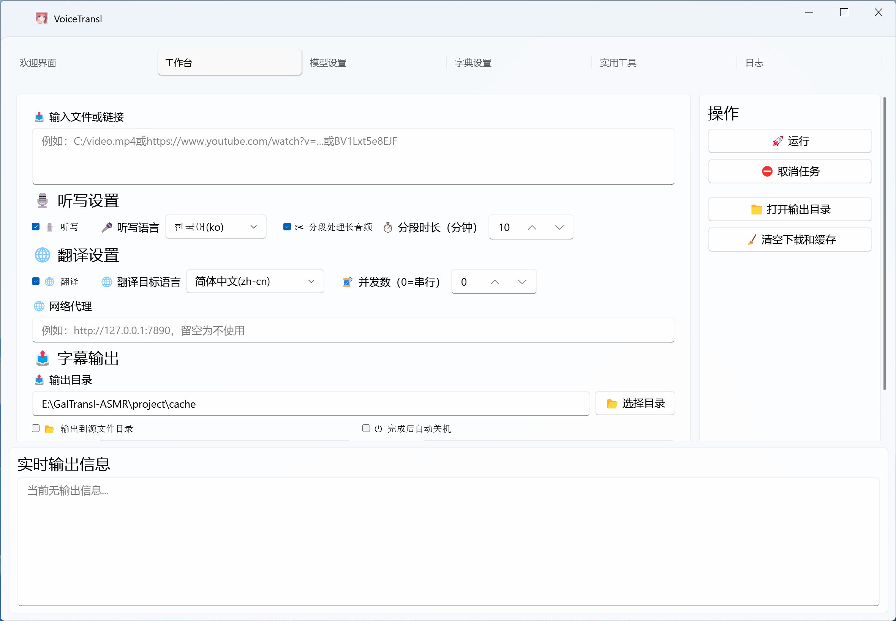

  

<h1 align="center">VoiceTransl</h1>

  
  
  

<a href="README.md">简体中文</a> | English

VoiceTransl is an all-in-one, offline AI application for generating and translating video subtitles on Windows and macOS. It provides a complete workflow for translators, including video downloading, audio extraction, transcription and timing, subtitle translation, video rendering, and subtitle summarization. This project is based on [GalTransl](https://github.com/xd2333/GalTransl) and is licensed under the GPLv3.

## Features

- Supports multiple translation models, including online models through any OpenAI-compatible API and local models through Sakura, GalTransl, Ollama, and llama.cpp.
- Supports AMD, NVIDIA, and Intel GPU acceleration, with configurable VRAM usage for the translation engine.
- Accepts multiple input formats, including audio, video, and SRT subtitle files.
- Produces SRT and LRC subtitles.
- Supports Japanese, English, Korean, Russian, and French.
- Uses CrispASR's Qwen3-ASR and forced alignment workflow to generate timestamped subtitles.
- Supports voice activity detection (VAD) to identify speech segments automatically.
- Supports custom translation dictionaries for input and output replacement.
- Accepts world-book and script content as custom translation reference material.
- Downloads videos directly from YouTube, Bilibili, and other media links.
- Supports batch processing of files and links with automatic file-type detection.
- Includes audio splitting, subtitle merging, and video rendering tools.
- Summarizes video content into concise, timestamped text.
- Separates vocals from accompaniment with support for multiple models.

  

## Online Image

For a ready-to-use cloud environment, VoiceTransl is available on the UCloud-backed Compshare GPU rental platform. Open the [VoiceTransl image](https://www.compshare.cn/images/compshareImage-16qc028dgfoh?referral_code=1RFfR2FQ2FyEVRJMyrOn5d&ytag=GPU_YY-GH_simple) and see the [video tutorial](https://b23.tv/qN9bDHi) for instructions.

Registering through the author's [referral link](https://passport.compshare.cn/register?referral_code=1RFfR2FQ2FyEVRJMyrOn5d&ytag=simple_bilibili) may provide account credits and a discount, subject to the platform's current terms.

## Download

Download the latest version from [GitHub Releases](https://github.com/shinnpuru/VoiceTransl/releases/). Extract the archive, then run `VoiceTransl.exe` on Windows.

## Usage

See the [video tutorial](https://www.bilibili.com/video/BV12FjN6iEmz) for usage instructions.

## Disclaimer

This software is intended only for learning and communication and must not be used for commercial purposes. The authors are not responsible for user conduct and do not guarantee the accuracy of translation results. By using this software, you agree to assume all associated risks, including copyright and legal risks. Follow your local laws and regulations, and do not use this software for unlawful activities.

## Contributors

[@shinnpuru](https://github.com/shinnpuru) [@MurthiNext](https://github.com/MurthiNext)

## If VoiceTransl helps you, please give it a star!

